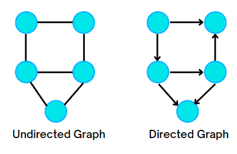
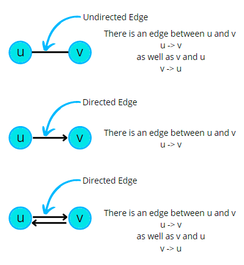
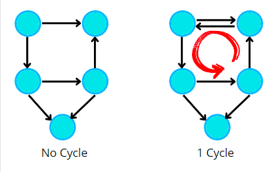
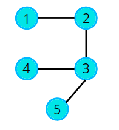
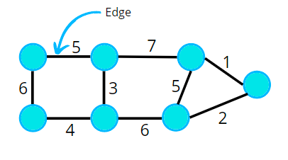

# Graphs

- Graph is a **Non-Liner data** structure.
- It has nodes that have data and are connected through the edges.

### Types of Graph

### Cycles in a Graph

- The Graphs may contain a cycle or not.
- Cyclic Graphs
  - UnDirected Cyclic Graph
  - Directed Acyclic Graph ( DAG )

### Path in Graph

- Path means a series of nodes from u to v wherein no nodes are repeated. 

- 1 2 3 5 is a path. 
- 1 2 3 2 1 is not a path, because a node can’t appear twice in a path. 
- 1 3 5 is not a path, as adjacent nodes must have an edge and there is no edge between 1 and 3.

### Degree

#### Degree of Node
- No of Nodes that go inside or outside form a node.

#### Degree of Graph
- the total degree of a graph is equal to twice the number of edges. 
- This is because every edge is associated/ connected to two nodes.

### Edge Weight
- A graph may have weights assigned on its edges. 
- It is often referred to as the cost of the edge.
- If weights are not assigned then we assume the unit weight.

- In applications, weight may be a measure of the cost of a route. 
- For example, if vertices A and B represent towns in a road network, then weight on edge AB may represent the cost of moving from A to B, or vice versa.

## Resources

