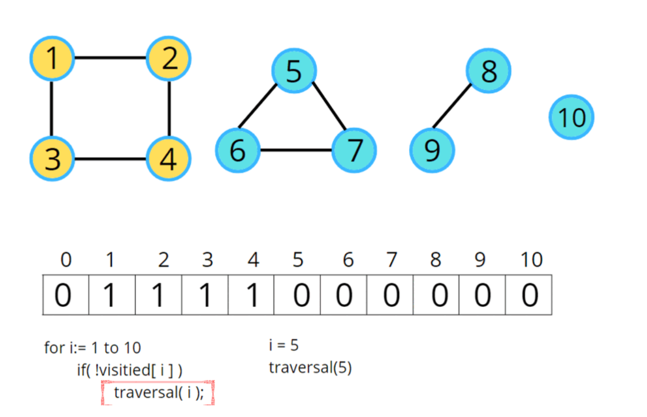

# Connected Components

In a connected component of a Graph there is a way to reach from u to v.

## Graph Traversal for Connected Componenets

We need to be careful while traversing a graph which is made of various connected components.

We can keep a visited array to keep track of all the nodes which we have already visited.
