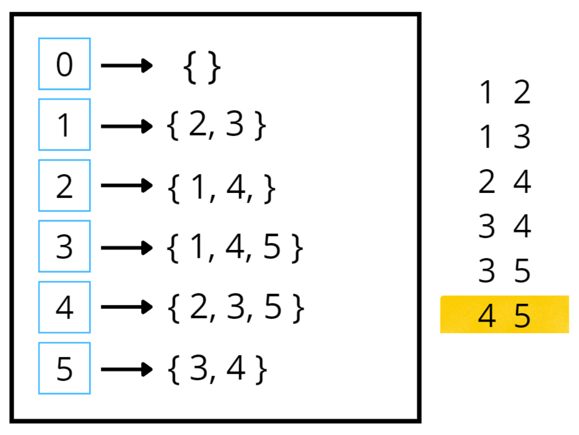

# Graph Representation 

Graph is a complex data structure and Hence we need to look into how we can store this complex Data Structure.

### Input for a Graph

- N = No of Nodes
- M = No of Edges
- List of M Edges

Eg - of a Undirected Graph Input

3 4

1 2

2 3

1 2

1 3

## Two ways to represent Graph

1. Matrix
2. Adjacency List

## Matrix 

An adjacency matrix of a graph is a two-dimensional array of size n x n.

**Space Complexity** - O(N^2)

It is a costly method as n² locations are consumed.

### Advantages of Adjacency Matrix:

- Representation is easier to implement and follow.
- Removing an edge takes O(1) time.
- Queries like whether there is an edge from vertex ‘u’ to vertex ‘v’ are efficient and can be done O(1).

### Disadvantages of Adjacency Matrix:

- Consumes more space O(V^2). Even if the graph is sparse(contains less number of edges), it consumes the same space.
- Adding a vertex takes O(V^2) time. 
- Computing all neighbors of a vertex takes O(V) time (Not efficient).

## Adjacency List

We store the grpah as a List< List<Adjacent Node> >.

**Space complexity** = O(2xE) for Undirected Graph and O(E) for directed Graph.

This representation is much better than the adjacency matrix, as matrix representation consumes n² locations, 
and most of them are unused.

### Advantages of Adjacency List:

- Saves space. Space taken is O(|V|+|E|). In the worst case, there can be C(V, 2) number of edges in a graph thus consuming O(V^2) space.
- Adding a vertex is easier.
- Computing all neighbors of a vertex takes optimal time.

### Disadvantages of Adjacency List:

- Queries like whether there is an edge from vertex u to vertex v are not efficient and can be done O(V).

## Weighted Graph

- For Matrix We can put weights for each edge.
- For Adjacency List , we can store **List<List<Pair(dest, weight)>>**

## Points to consider while representing a Graph -

1. **Is Graph 0 OR 1 based indexed.**
   1. If its 0 then we need to create Matrix/Adj List till ( 0 -> N-1)
      1. mat graph[][] = new int[N][N]
   2. If its 1 based indexing then we need to create Matrix/Adj List till ( 1 -> N)
      1. mat graph[][] = new int[N+1][N+1]
2. **Is Graph Directed or Undirected**
   1. For Undirected Graph , if there is a an (u->v) then we need to add an edge (v->u) also in matrix/Adj List.
   2. For Directed , we do not need to do anything such.
3. **Is Graph Weighted or Unweighted**
   1. For Weighted Graph
      1. In Matrix -> We can put weights at the intersection.
      2. In List we can create a **Pair**. **( src -> (dest, weight))**
   2. For Unweighted Graph , we can assume weight=1 and skip adding weights.

