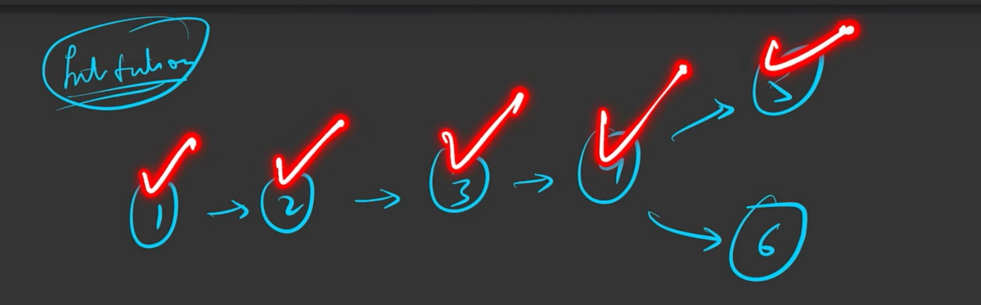

# Topological Sort Using DFS

## Intution
- We can think of this as when we complete DFS of a node then we can put that into stack.


https://youtu.be/5lZ0iJMrUMk?list=PLgUwDviBIf0oE3gA41TKO2H5bHpPd7fzn

## Additional Data Structure - Stack

## Algorithm

1. We must traverse all components of the graph.
2. Make sure to carry a visited array(all elements are initialized to 0) and a stack data structure, where we are going to store the nodes after completing the DFS call.
3. In the DFS call, first, the current node is marked as visited. Then DFS call is made for all its adjacent nodes.
4. **After visiting all its adjacent nodes, DFS will backtrack to the previous node and meanwhile, the current node is pushed into the stack.**
5. Finally, we will get the stack containing one of the topological sortings of the graph.

## Code 

```java
public class Solution {

    public static List<Integer> topologicalSort(int[][] edges, int e, int v) {

        // Build Adjacency List from Edge List
        List<List<Integer>> graph = new ArrayList<>();
        for(int i=0; i<v; i++){
            graph.add(new ArrayList<>());
        }
        for(int i=0; i<e; i++){
            graph.get(edges[i][0]).add(edges[i][1]);
        }
        
        // Declare a Stack to store topo order and visted array
        boolean visited[]  = new boolean[v];
        Stack<Integer> stk = new Stack<>();

        for(int i=0; i<v; i++){
            if(!visited[i]){
                dfs(i, graph, visited, stk, v);
            }
        }
        
        List<Integer> topologicalOrder = new ArrayList<>();
        // Do DFS
        while(!stk.isEmpty()){
            topologicalOrder.add(stk.pop());
        }
        return topologicalOrder;
    }

    private static void dfs(int node, List<List<Integer>> graph, boolean visited[], Stack<Integer> stk, int numVertex){
        visited[node] = true;
        for(int nbr : graph.get(node)){
            if(!visited[nbr]){
                dfs(nbr, graph, visited, stk, numVertex);         
            }            
        }
        // Once DFS is completed for a node we can add it to stack 
        stk.push(node);
    }

}
```