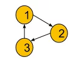

# Topological Sort

The topological sorting of a directed acyclic graph is nothing but the **linear ordering** of vertices such that **if there is an edge between node u and v (u -> v), node u appears before v in that ordering**.

- Topological Sort is possible for DAG only. ( Directed Acyclic Graph )
- In Directed Graph :- In a an undirected graph if there is an edge between u -> v then it signifies bidirectinal path between u and v. So Topo sort is not possible for that.
  - So it is practically impossible to write such ordering where u appears before v and v appears before u simultaneously. So, it is only possible for directed edges.

- In Cyclic Graph :- 

