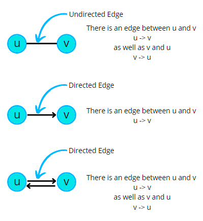

# Graphs

- Graph is a **Non-Liner data** structure.
- It has nodes that have data and are connected through the edges.

### Types of Graph

### Cycles in a Graph

- The Graphs may contain a cycle or not.
- Cyclic Graphs
  - UnDirected Cyclic Graph
  - Directed Acyclic Graph ( DAG )

### Path in Graph

- Path means a series of nodes from u to v wherein no nodes are repeated. 

- 1 2 3 5 is a path. 
- 1 2 3 2 1 is not a path, because a node can’t appear twice in a path. 
- 1 3 5 is not a path, as adjacent nodes must have an edge and there is no edge between 1 and 3.

## Resources

